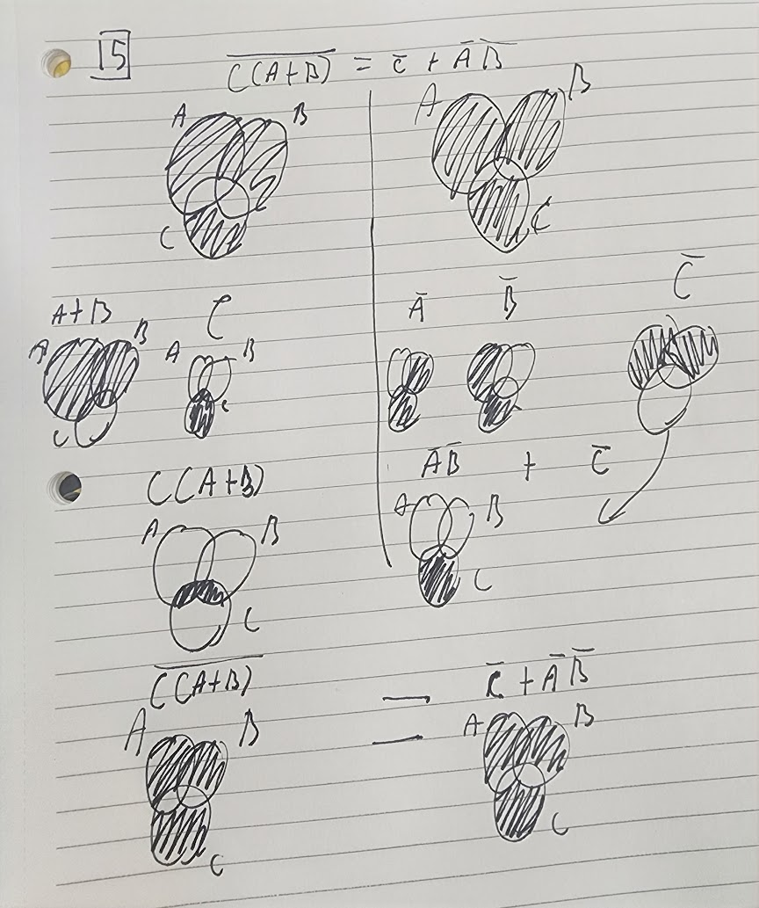
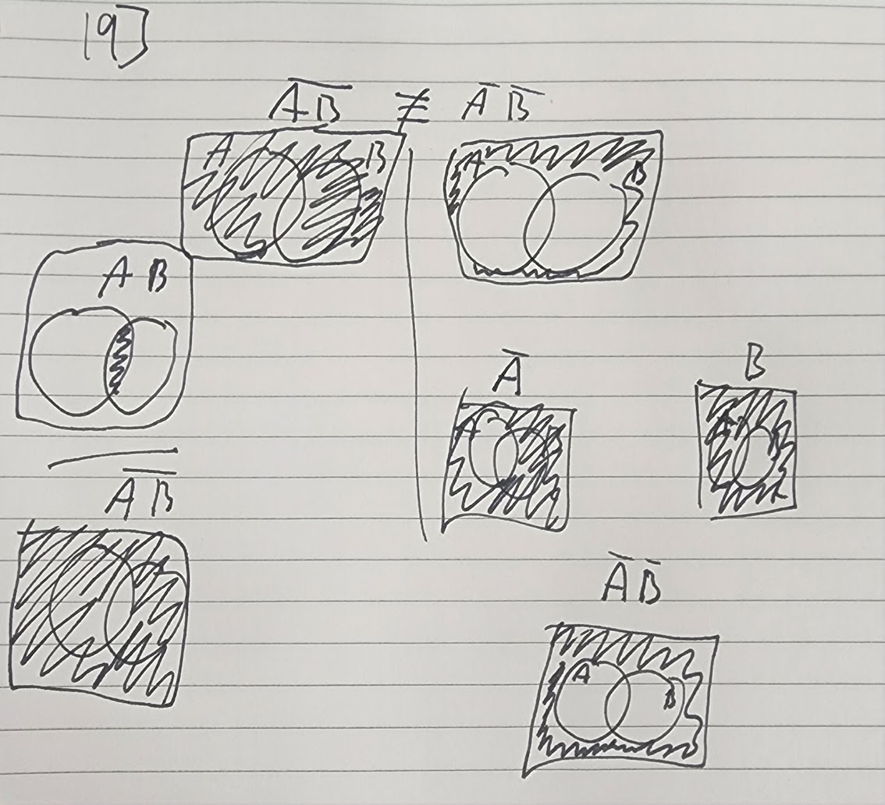

##  Final Exam

1. Model validation is checking that the projection or display model is correct for the data set based on testing it. Model calibration is establishing the data set and ensuring that a proper 0 is found.  
2. Data values that are made into quantifiable features, ex: color, line weight, and point size and shape.  
3. The second one as it is better for color blindness.
4. a. Qualitative color scale to distinguish discrete items or groups that do not have an intrinsic order b. data values that an order, best for temperature and income c. diverging color scale, data in one of two directions that has a neutral middle point d. simple scale with accent colors  
5. experiment/observations, theory, and simulation/data-driven models  
6. Logical implication is not the same as physical causation because if A is rain and B is clouds it can be cloudy and not be raining. It is raining therefore it is cloudy, the dense clouds caused the rain, not the rain causing clouds to form.
7. 1. Visually the line of fit works because it shows the global temperature is increasing. 2. epistatic 3. positive correlation 4. yes, because 5. 0.070925267  
8. Bayesian and Classical Probability  
9. Bayesian and Classical Probability  
10. Frequentist Probability because you can not use prior knowledge or infer so since you can not pull facts of the existence of god this theory does not work  
11. The zeros do not align.  
12. Everything represented by integers in computers because of the way binary code was designed.  
13. B  
14. Assembly or Fortran  
15.   
16. For A ⇒ B, when A is true B will also be true but B can be true and A not be true. So, B¯⇒ A¯ is also true because if A is true when B is true then if B is true, the point is in the universe but not either circle, then A cannot be true.  
17. Deductive(The lamp is on so the bulb is hot, the lamp is off so the bulb is cold) and plausible(The bulb is hot so the lamp is likely on, but it could be off now but was recently on)  
18. If two Boolean propositions are equal then it means they hold the same truth statement and have the same result  
19.   
20. No
21. S = 1632, you can use the arithmatic summation equation to find the answer. (n1+n33)((n-1)/2) = S    (3+99)(32/2)=S
