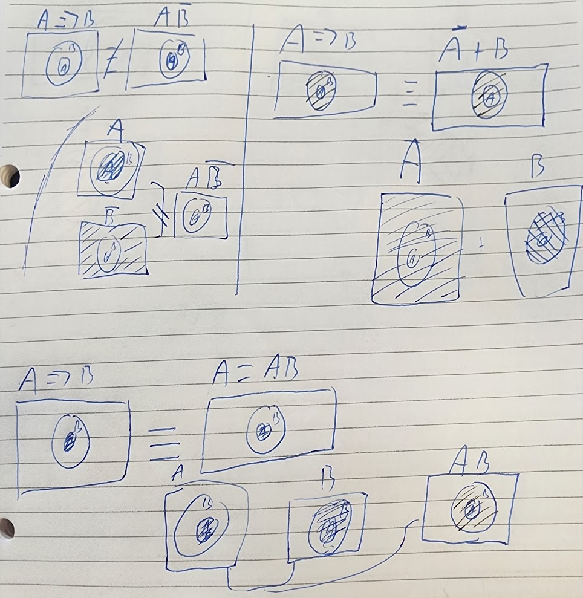
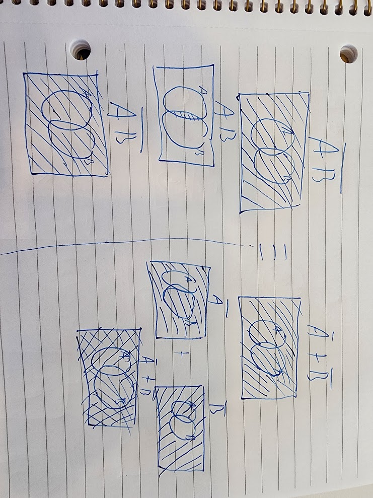
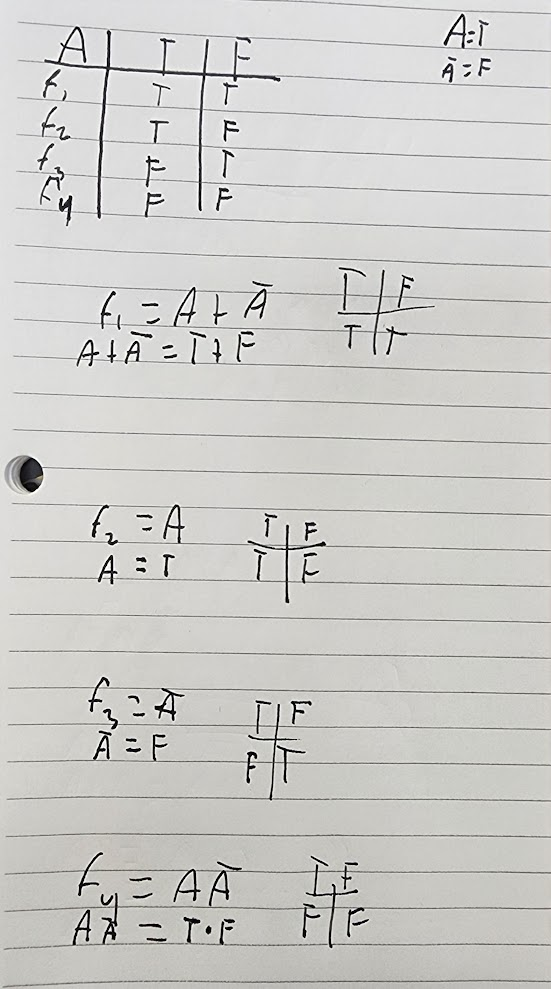
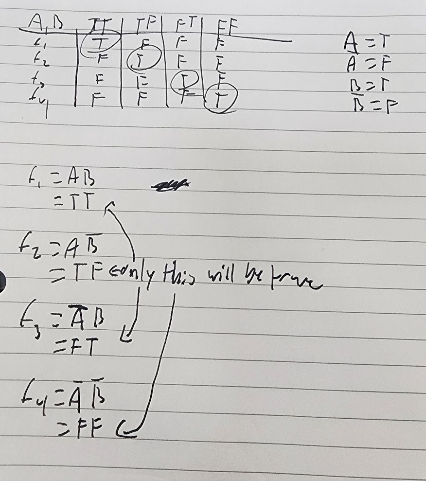
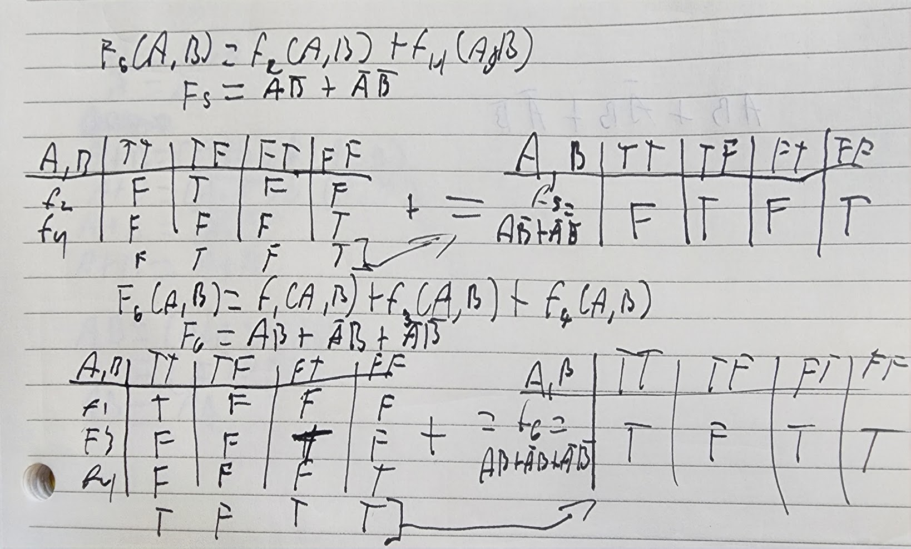
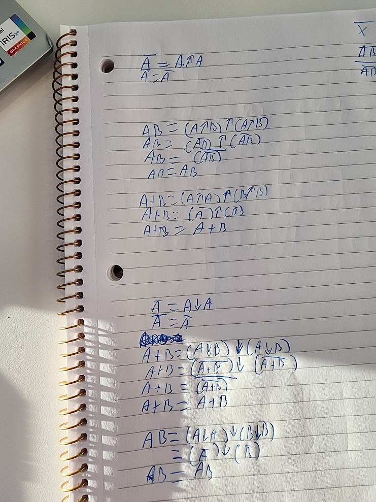

1. experiment/observations, theory, and simulation/data-driven models
2. Predictive computing (which cells are alive after a stroke), numerical simulation (adaptive stochastic sampling method), data-driven discovery (detecting cars on a road)
3. inductive and deductive
4. a is rain and b is clouds. A logical consequence is not the same as physical as it can be cloudy and not be raining. It is raining therefore it is cloudy, the dense clouds caused the rain, not the rain causing clouds to form.
5. If A and B is true, then C is true
6. 
7. 
8. 
9. 
10. 
11.   
12. 
  a. a bit(0s and 1s)  
  b. This is the smallest as it represents on and off. You would need to have a reference point to know factors of your placement.  
  c. 1. 2 things 2. 4 things 3. 8 things   
