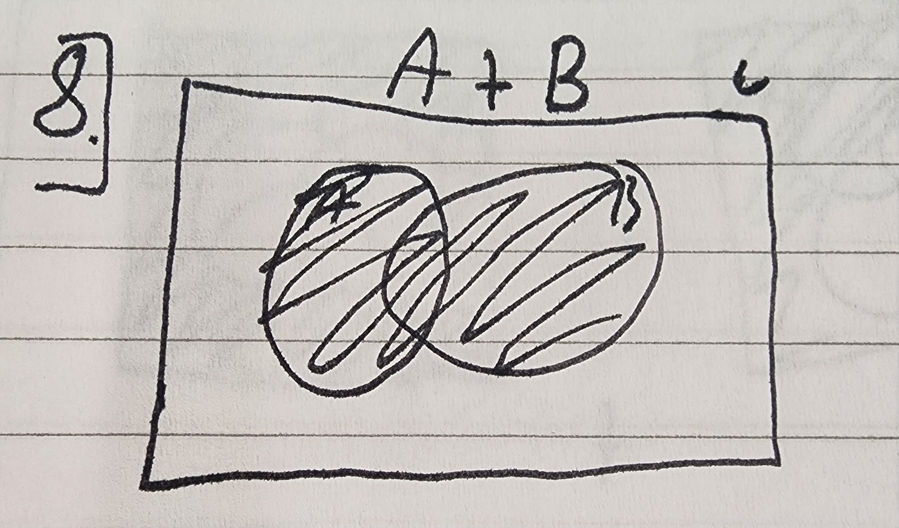

### Quiz 3
  
1. You begin by observing natural phenomena, you observe and collect data, you create and adjust a solution, you make a prediction, and then you watch the phenomena for change.
2. The three pillars of science are experiment/observations, theory, and simulation/data-driven models  
3. The third pillar, data-driven models, could replace the other two by
4. The two categories of reasoning are deductive and plausible. In deductive reasoning we can only have a true or false answer, the light is on or off. With plausible reasoning the verification of a consequence of A will give confidence to its truth but won't prove it, A = it will start to rain by 10 am at the latest and B ≡ the sky will become cloudy before 10 am.
5. Logical implication is not the same as physical causation as A implication B, where A is rain and B is that it is cloudy, would mean that because it is rain it is cloudy as a logical implication but that the physical causation is that because clouds formed it was able to rain.
6. George Boole
7. 
8. 
9. When they are equal it indicates a truth value, they hold the same truth
10. 
11. 
12. 
13. 
14. 
15. 
16. 
17. 
18. This was a pretty fair quiz, basically everything we covered in class was on this quiz (aside from some of the application stuff that was not covered in class or on the homework). We did not cover the NOR and NAND functions much though so those questions were pretty tough. 
