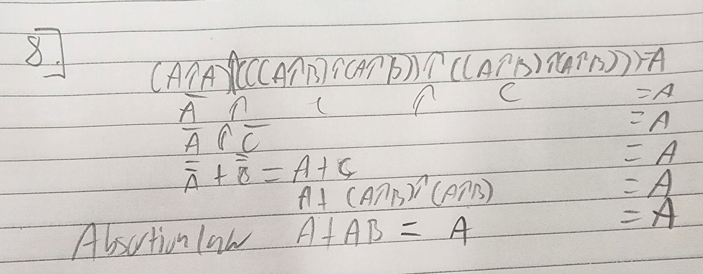
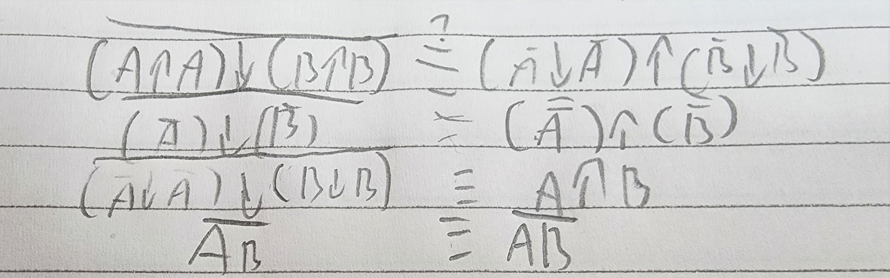
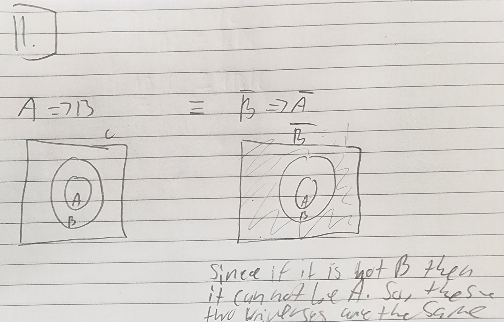

##  Quiz 4  
  
1. classical, empirical, subjective, and axiomatic  
2. Classical Probability and Bayesian Probability  
3. Classical Probability and Bayesian Probability  
4. Bayesian Probability  
5. Pierre Laplace(Bayesian) and Ronald Fisher(Frequentist)  
6. The range is either [0,1] or [1,+infinity] and this is by convention through propositions with a greater degree of plausibility corresponding to greater real numbers.  
7. You would choose the one that makes the most sense based on prior knowledge and likelihood using Bayesian probability theory. You can use the Bayesian rule by comparing likelihood, prior occurrence, and evidence to find a suitable answer or determine that you can not find an answer as it could be epistemic.  
8.   
9.   
10.   
11. 11.   
