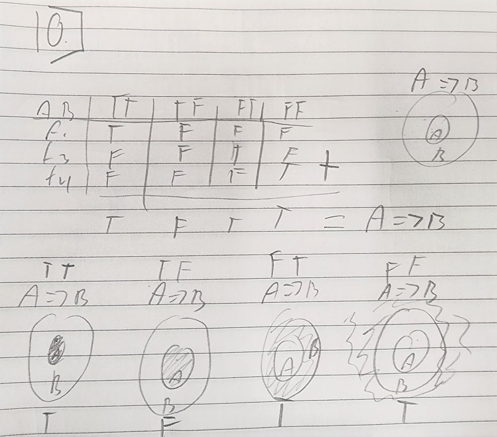

##  Quiz 4  
  
1. classical, empirical, subjective, and axiomatic  
2. Classical Probability and Bayesian Probability  
3. Classical Probability and Bayesian Probability  
4. Bayesian Probability
5. Pierre Laplace(Bayesian) and Ronald Fisher(Frequentist)
6. The range is either [0,1] or [1,+infinity] and this is by convention through propositions with greater degree of plausibility corresponding to greater real numbers
7. 
8.   
9.   
10.   
11. 11.   
